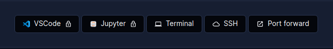

# Coder Deeplearning Template

A deeplearning template for [Coder](https://coder.com/).

## Coder Setup

Follow these steps to configure accessing your workspaces locally on any machine.

### Linux/MacOS

1. Open a terminal and run

   ```bash
   curl -L https://coder.com/install.sh | sh
   ```

### Windows

1. Open a `powershell` window and run

   ```powershell
   winget install Coder.Coder
   ```

## Usage

1. Clone this repository

   ```bash
   git clone https://github,com/matifali/coder-templates
   cd coder-templates/deeplearning
   ```

2. Login to coder

   ```bash
   coder login CODER_URL
   ```

3. Create a template

   ```bash
   coder templates create deeplearning
   ```

4. Create a workspace

   Go to `https://CODER_URL/workspaces` and click on **Create Workspace** and select **deeplearning** template.

> Note: Do not forget to change the `CODER_URL` to your coder deployment URL.

## Connecting

There are multiple options to connect to your workspace using local clients or browser.


### VS Code Browser

Click on the VS Code Browser icon to launch a VS Code server that you can connect from your browser.

### Jupyter Lab

Click on the jupyter icon to launch a jupyter lab server that you can connect from your browser.

Also, you can connect using the **Web Terminal** or **SSH** by clicking on the above buttons.

### VS Code Desktop

Click on the VS Code Desktop icon to conNect to your workspace using VS Code Desktop.

### JetBrains Gateway

Follow the [instructions](https://coder.com/docs/v2/latest/ides/gateway) to use the JetBrains Gateway with Coder.

## Docker Images

Deeplearning images used in the template are available at [dockerhub](https://hub.docker.com/repository/docker/matifali/dockerdl).

Source code of deeplearning images is available at, [https://github.com/matifali/dockerdl](https://github.com/matifali/dockerdl)
