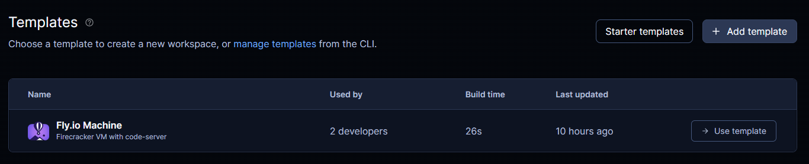
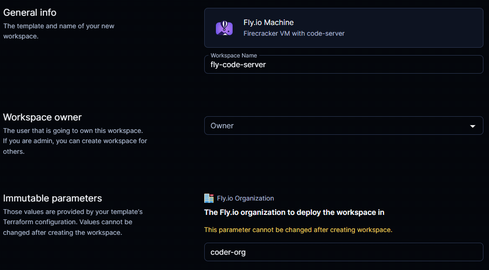
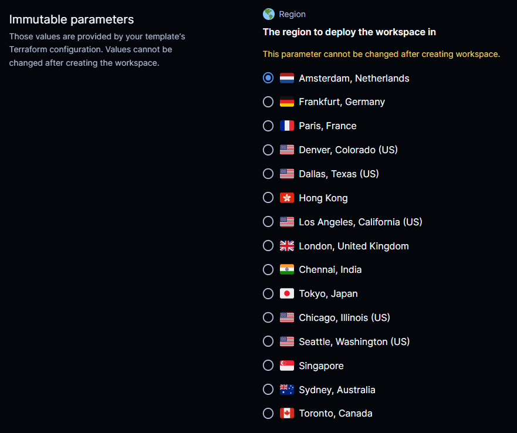
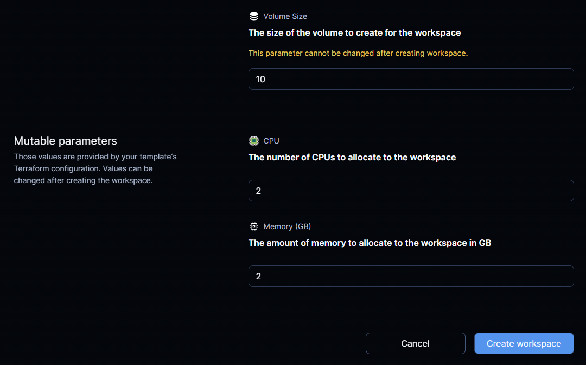

# Coder fly.io template

This template provisions a [code-server](https://github.com/coder/code-server) instance on [fly.io](https://fly.io).

## Prerequisites

- [flyctl](https://fly.io/docs/getting-started/installing-flyctl/) installed.
- [Coder](https://coder.com/) already setup and running with coder-cli installed locally.

## Deploy

1. Clone this repo and cd into `fly-code-server` directory.
2. Add a secret or environment variable to your Coder deployment with the name `FLY_API_TOKEN` and the value of your fly.io API token.

```shell
flyctl auth login
export FLY_API_TOKEN=$(flyctl auth token)
```

> This is needed to deploy the workspace to fly.io.

3. Run `coder templates create fly-code-server` to create a template in Coder.
   
4. Create a new workspace from the template.
   
   
   

This is all. You should now have a code-server instance running on fly.io.
