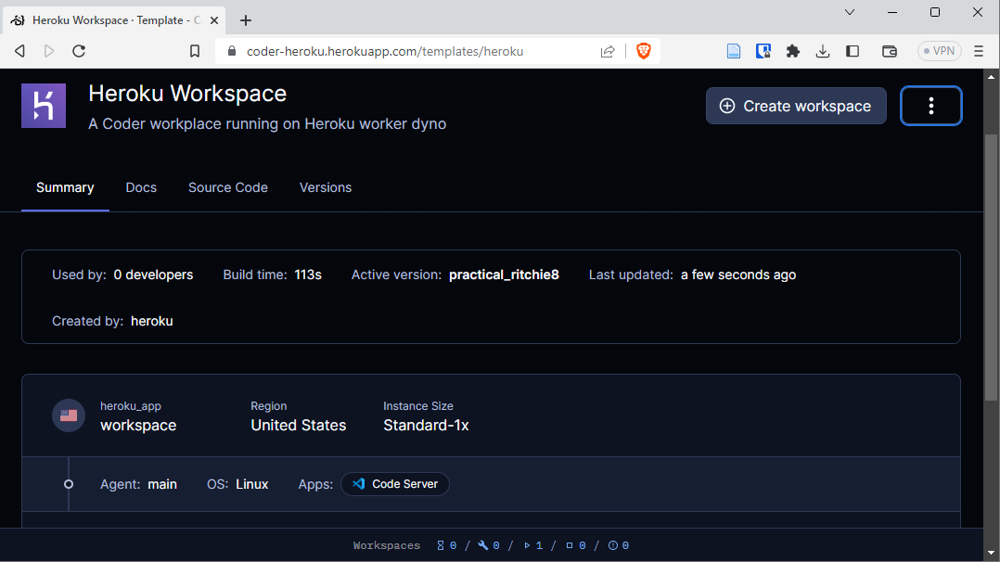

# Coder Heroku worker dyno template

This template provisions a [code-server](https://github.com/coder/code-server) instance on [Heroku](https://heroku.com) using the [codercom/code-server](https://hub.docker.com/r/codercom/code-server) image as a worker dyno.

## Prerequisites

- [heroku cli](https://devcenter.heroku.com/articles/heroku-cli#install-the-heroku-cli) installed.
- [Coder](https://coder.com/) already setup and running with coder-cli installed locally.

## Getting started

1. Run `coder templates init` and select this template. Follow the instructions that appear.
2. cd into the directory that was created. (e.g. `cd heroku-worker-dyno`)
3. Create the new template by running the following command from the `heroku-worker-dyno` directory:

```bash
coder templates create heroku-worker-dyno \
  --variable heroku_api_key=$(heroku auth:token)
```

> Read the [docs](https://github.com/coder/packages/blob/main/heroku/README.md) to learn more about how to deploy Coder on Heroku.

4. Navigate to the Coder dashboard and create a new workspace using the template.




This is all. You should now have a code-server instance running on Heroku.
